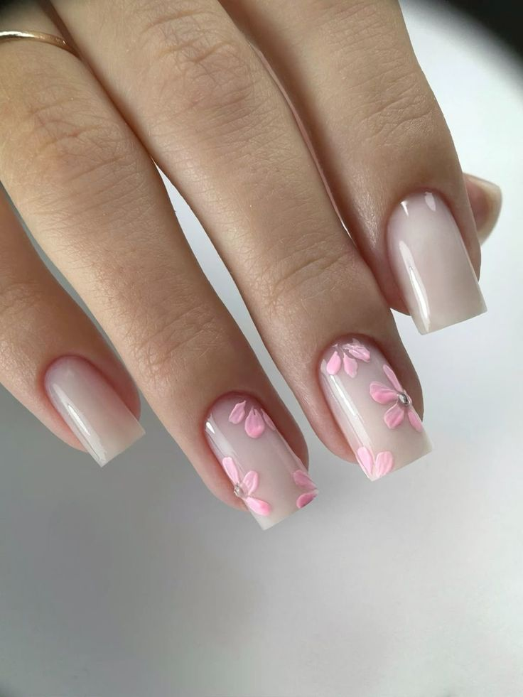
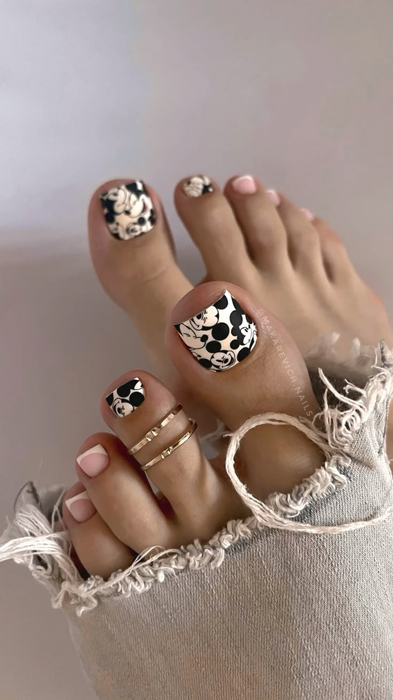

<html lang="ru">
<head>
    <meta charset="UTF-8">
    <meta name="viewport" content="width=device-width, initial-scale=1.0">
    <title>Салон Маникюра и Педикюра</title>
    <link rel="stylesheet" href="styles.css">
    <link rel="stylesheet" href="https://cdnjs.cloudflare.com/ajax/libs/font-awesome/5.15.4/css/all.min.css">
</head>
<body>
    <header>
        <h1>Салон Маникюра и Педикюра</h1>
        <nav>
            <ul>
                <li><a href="#services">Услуги</a></li>
                <li><a href="#gallery">Галерея</a></li>
                <li><a href="#testimonials">Отзывы</a></li>
                <li><a href="#contact">Контакты</a></li>
            </ul>
        </nav>
    </header>
    <main>
        <section id="services">
            <h2>Наши Услуги</h2>
            

                <h3>Маникюр</h3>
                
Классический, аппаратный, гелевый и другие виды маникюра.

                
Цена: от 800 ₽

            

            

                <h3>Педикюр</h3>
                
Классический, аппаратный, спа-педикюр и другие виды.

                
Цена: от 1200 ₽

            

            

                <h3>Наращивание ногтей</h3>
                
Гелевое и акриловое наращивание ногтей.

                
Цена: от 2000 ₽

            

        </section>
        <section id="gallery">
            <h2>Галерея</h2>
            

                
                
                
                <!-- Добавьте больше изображений здесь -->
            

        </section>
        <section id="testimonials">
            <h2>Отзывы</h2>
            

                
"Отличный сервис и профессиональные мастера!" - Анна

            

            

                
"Я довольна результатом, обязательно приду снова!" - Мария

            

            <!-- Добавьте больше отзывов здесь -->
        </section>
        <section id="contact">
            <h2>Контакты</h2>
            
Телефон: <a href="tel:+79000000000">+7 (900) 777-55-95</a>

            
Email: <a href="mailto:info@manicure-salon.ru">info@manicure-salon.ru</a>

            
Адрес: г. Москва, ул. Примерная, д. 1

        </section>
    </main>
    <footer>
        
© 2023 Салон Маникюра и Педикюра. Все права защищены.

        

            <a href="#"><i class="fab fa-facebook-f"></i></a>
            <a href="#"><i class="fab fa-instagram"></i></a>
            <a href="#"><i class="fab fa-vk"></i></a>
        

    </footer>
    
</body>
</html>
body {
    font-family: Arial, sans-serif;
    margin: 0;
    padding: 0;
    line-height: 1.6;
    background-image: url('background.jpg'); /* Замените 'background.jpg' на путь к вашему изображению */
    background-size: cover; /* Чтобы изображение заполнило весь фон */
    background-repeat: no-repeat; /* Чтобы изображение не повторялось */
    background-position: center; /* Центрирование изображения */
}

header {
    background-color: rgba(248, 200, 200, 0.8); /* Полупрозрачный фон для заголовка */
    color: #333;
    padding: 20px;
    text-align: center;
}

nav ul {
    list-style-type: none;
    padding: 0;
}

nav ul li {
    display: inline;
    margin: 0 15px;
}

.service {
    border: 1px solid #ddd;
    padding: 10px;
    margin: 10px 0;
    background-color: rgba(255, 255, 255, 0.9); /* Полупрозрачный фон для услуг */
}

.gallery-images {
    display: flex;
    flex-wrap: wrap;
}

.gallery-images img {
    width: 30%;
    margin: 5px;
}

.testimonial {
    background-color: rgba(240, 240, 240, 0.9); /* Полупрозрачный фон для отзывов */
    padding: 10px;
    margin: 10px 0;
}

footer {
    background-color: rgba(255, 192, 203, 0.8); /* Полупрозрачный фон для футера */
    color: #333;
    text-align: center;
    padding: 10px;
    position: relative;
    bottom: 0;
    width: 100%;
}

Найти еще
